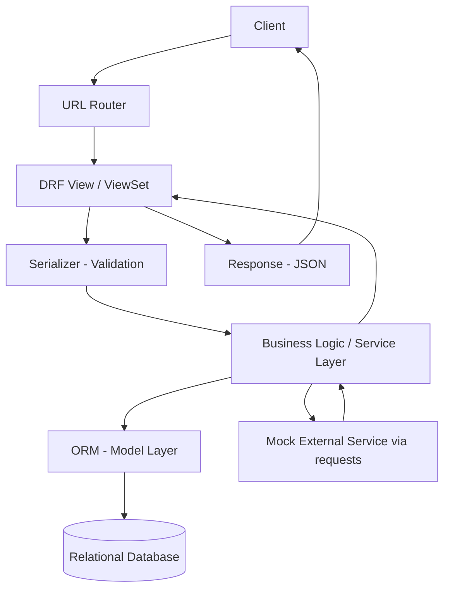
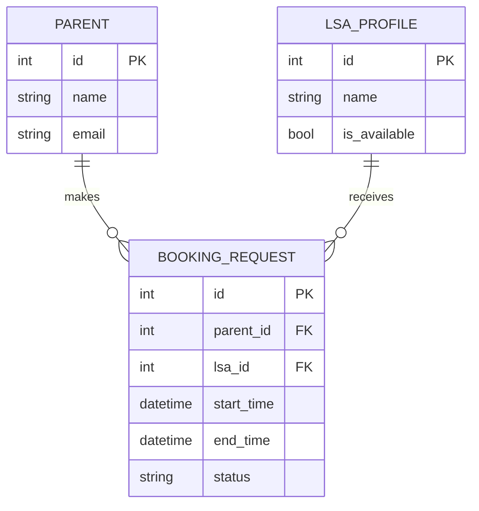

# Software Requirements Specification (SRS)
## HabotConnect – Python Backend Developer Hiring Project

---

### 1. Document Information

| Field | Value |
|---|---|
| Project Name | LSA Service Booking Module |
| Position | Junior/Python Backend Developer |
| Organization | HabotConnect FZCO |
| Document Type | Software Requirements Specification (SRS) |
| Version | 1.0 |
| Date | 10 August 2026 |
| Source Document | "Hiring Project Form – Python Backend Developer – Habot 1.0" (280726) |
| Purpose | To define, in a single reference, exactly what the HabotConnect hiring assignment requires, distinguish official requirements from implementation assumptions, and serve as the specification used to build the project. |

---

### 2. Project Overview

HabotConnect is building a 100% remote digital platform that connects **Parents** with **Learning Support Assistants (LSAs)** for children with learning difficulties. To support this, the assignment requires a backend module — the **LSA Service Booking module** — built as modular, lightweight RESTful APIs on Python and Django/Flask.

The assignment is explicitly framed as a **hiring simulation**: it recreates a realistic backend task (schema design, API implementation, query optimization, third-party integration, testing, and documentation) rather than asking theoretical questions, and it evaluates independent handling of ambiguous requirements.

No further business context (billing model, user-facing app, notification system, etc.) is specified. This document only covers what is needed to satisfy the backend module described in the assignment.

---

### 3. Purpose and Objectives

Per the assignment, the project is intended to demonstrate the candidate's ability to:

- Write clean Python code with correct backend framework architecture (Django MVT or Flask MVC)
- Design and implement RESTful APIs with a framework's DRF/Flask-RESTful tooling
- Design a normalized, indexed relational schema and use an ORM correctly
- Identify and resolve database query performance issues, specifically the N+1 query problem
- Implement input validation and business-rule enforcement (double-booking prevention)
- Integrate a third-party mock service safely (timeouts, exceptions, logging)
- Write automated tests (pytest/unittest) covering success, edge, and failure cases
- Set up a CI pipeline (GitHub Actions) that runs tests automatically
- Produce clear technical documentation and a presentation explaining the above

---

### 4. Scope

#### In Scope (explicitly required by the assignment)
- `Parent`, `LSA_Profile`, `Booking_Request` data models with relationships, constraints, indexes, and migrations
- `POST /api/v1/bookings/` endpoint
- `GET /api/v1/lsas/search/` endpoint, filterable by skills, N+1-safe
- Double-booking / overlapping-session prevention
- One mock third-party integration (e.g., payment gateway or verification API) via `requests`
- At least 5 automated tests (pytest or unittest)
- GitHub Actions CI workflow (install deps → run tests → fail on failure)
- README.md with setup instructions, API docs, and optimization explanation
- A presentation (Google Slides/PowerPoint, max 15 slides)

#### Out of Scope / Not Specified in the Assignment
- User authentication/authorization on the API endpoints — **not specified**
- Frontend/UI of any kind
- Payment processing logic beyond a mock integration
- Notification systems (email/SMS)
- Deployment to a live server/hosting — **not specified**
- Multi-tenancy, admin roles, or permission levels — **not specified**

> **Ambiguity flagged:** The "Outcome" section of the assignment additionally describes a **4th entity, `Payment`**, and a dedicated **`POST /api/payments/webhook/`** endpoint that transitions booking states on payment events. However, the "You are Expected To Do" task list — which enumerates the actual graded deliverables — lists only 3 entities and 2 endpoints, and describes the third-party integration generically as "a mock payment gateway *or* verification API." This document treats the `Payment` model and webhook as an **optional stretch goal** (Section 20), not a core requirement, since the task list is the more operational, itemized source. This should be called out explicitly as an assumption in the final README.

---

### 5. Functional Requirements

#### FR-01: Parent Management
The system must model a `Parent` entity representing a guardian who books LSA services. *Official requirement:* the entity must exist and participate in the booking relationship. Exact fields beyond an identifier are not specified — see Section 9 for proposed/assumed fields.

#### FR-02: LSA Profile Management
The system must model an `LSA_Profile` entity representing a Learning Support Assistant who can be booked, with the ability to be filtered by skill in search. *Official requirement:* entity must exist, must support skill-based search, and must have some notion of availability (implied by "search available LSAs"). Exact fields are not specified beyond this.

#### FR-03: Booking Request
The system must model a `Booking_Request` entity that relates a `Parent` to an `LSA_Profile` for a specific session. *Official requirement:* the entity and its relationships to Parent and LSA_Profile must exist, with appropriate foreign keys, data types, and constraints.

#### FR-04: Create Booking — `POST /api/v1/bookings/`
- **Purpose:** Accept a new booking request and persist it.
- **Request:** Not explicitly specified. *Proposed/assumed* payload: parent identifier, LSA identifier, start time, end time.
- **Validation:** Officially required — "validates payload inputs." Must reject malformed/missing fields with an appropriate error.
- **Database operation:** Store the booking; must not allow it to conflict with an existing booking for the same LSA (see FR-06).
- **Success response:** Not explicitly specified. *Proposed:* HTTP 201 with the created booking representation.
- **Failure/error handling:** Officially required — "handle invalid input properly." *Proposed:* HTTP 400 for validation errors, HTTP 409 (or equivalent conflict signal) for double-booking.
- **Double-booking prevention:** Officially required (see FR-06).

#### FR-05: LSA Search — `GET /api/v1/lsas/search/`
- Officially required to retrieve **available** LSAs, **filterable by skills**, with the query **optimized to avoid the N+1 problem**.
- Exact filter parameter names/format are not specified. *Proposed:* a `skills` query parameter accepting one or more skill names.
- "Available" is not formally defined by the assignment. *Proposed assumption:* an `is_available` boolean flag on `LSA_Profile`, or absence of a currently active conflicting booking — the specific definition should be stated as an assumption in the README.

#### FR-06: Double-Booking Prevention
Officially required: the booking API must prevent overlapping/double bookings. The assignment does not specify the exact conflict rule (e.g., whether adjacent bookings are allowed). *Proposed assumption:* two bookings for the same LSA conflict if their `[start_time, end_time)` ranges overlap; this must be enforced against race conditions, not just checked-then-written.

#### FR-07: Third-Party Mock Integration
Officially required: integrate one mock external service (payment gateway **or** verification API, per the assignment's own phrasing — either satisfies the requirement) using Python's `requests` library, with:
- Successful response handling — official requirement
- Failure response handling — official requirement
- Timeout handling — official requirement
- Exception handling — official requirement
- Logging — official requirement

Which specific mock service (payment vs. verification) is **not mandated** — this is an implementation choice, to be stated as an assumption.

#### FR-08: Automated Testing
Officially required: at least 5 tests using pytest or unittest, covering success, edge, and failure cases. The assignment explicitly names as areas to cover: successful booking, invalid booking, overlapping/double booking, LSA search, and external service success/failure.

#### FR-09: CI/CD
Officially required: a GitHub Actions workflow that installs dependencies, runs the automated tests, and fails the workflow if tests fail. Trigger condition (push, PR, etc.) is not specified — *proposed:* trigger on push.

---

### 6. Non-Functional Requirements

#### NFR-01: Performance
- Officially required: database queries must be optimized, specifically avoiding the N+1 query problem in LSA search.

#### NFR-02: Reliability
- Officially required (implied by "handle invalid input properly" and the exception-handling requirements on the external integration): the API must behave predictably under invalid input and external-service failure, not crash unhandled.

#### NFR-03: Security
- **Not specified in the assignment.** No authentication, authorization, rate-limiting, or input-sanitization-beyond-validation requirement is stated. Basic input validation (FR-04) covers correctness, not security hardening. Any security measures beyond standard framework defaults should be treated as a bonus, not a requirement.

#### NFR-04: Maintainability
- Officially required (per "Project Quality" section of the assignment): clean Python code, proper folder structure, modular organization (models/views/serializers/services separated as appropriate).

#### NFR-05: Testability
- Officially required: automated tests must exist and be runnable via CI.

#### NFR-06: Documentation
- Officially required: README.md covering setup, API documentation, design decisions, and query-optimization explanation.

---

### 7. Technology Requirements

Per the assignment, the following are **officially required or explicitly permitted**:

- Python
- **Django + Django REST Framework (DRF) OR Flask + Flask-RESTful** — assignment explicitly allows either; it does not mandate one
- PostgreSQL or MySQL
- An ORM (Django ORM or SQLAlchemy)
- `requests` library for the mock integration
- pytest or unittest
- Git/GitHub, with a structured branching/PR workflow (mentioned under assessment criteria)
- GitHub Actions

#### Recommended Implementation Stack

*(Our implementation decision, not an assignment mandate.)*

**Django + Django REST Framework** is recommended:
- The Django ORM provides `select_related`/`prefetch_related` directly, which maps to the assignment's explicit N+1-avoidance requirement.
- Django's migration system and model-level constraints (`UniqueConstraint`, `CheckConstraint`) reduce hand-written boilerplate for schema requirements.
- DRF serializers give a clean, idiomatic way to satisfy the input-validation requirement.
- Django admin gives a free working UI for demoing data during the interview/presentation.
- SQLite can be used for local development/testing to keep setup simple, with PostgreSQL/MySQL noted as the production-equivalent target — this substitution should be stated as an assumption if used.

---

### 8. System Architecture

**Assignment requirement:** understand and be able to explain Django MVT or Flask MVC architecture and how a request flows through it.

Request flow (implementation-level, Django/DRF):



- **Validation layer:** DRF serializer checks required fields, types, and business rules before anything touches the database.
- **Business logic:** overlap checking, availability logic, and orchestration of the external call live here — kept separate from both the view and the raw model, so the view stays thin.
- **ORM/Database:** the model layer is the only part that talks to the database, using indexed, prefetch-optimized queries.
- **External service interaction:** isolated in its own module so the booking logic doesn't depend on network reliability, and so it can be tested independently by mocking the `requests` call.

---

### 9. Database Requirements

**Officially required entities:** `Parent`, `LSA_Profile`, `Booking_Request`, with appropriate data types, primary/foreign keys, relationships, constraints, and indexes, plus migrations.



- **Relationships:** `Booking_Request` has a foreign key to `Parent` and a foreign key to `LSA_Profile` — officially required.
- **Constraints:** officially required generically ("constraints") — no specific rule is named beyond the overlap prevention. *Proposed:* a non-overlap constraint/check enforced at the application layer.
- **Indexes:** officially required generically ("indexes where useful"). *Proposed:* an index on `Booking_Request(lsa_id, start_time, end_time)` to make overlap/availability lookups fast, and an index supporting skill search on `LSA_Profile`.
- **Migrations:** officially required.

#### Proposed/Assumed Fields
*(Not specified by the assignment — reasonable defaults for implementation.)*

| Entity | Proposed Fields |
|---|---|
| Parent | `id`, `name`, `email`, `phone`, `created_at` |
| LSA_Profile | `id`, `name`, `skills` (many-to-many via a `Skill` table, to make search an indexed join rather than a text match), `is_available`, `created_at` |
| Booking_Request | `id`, `parent` (FK), `lsa` (FK), `start_time`, `end_time`, `status` (`pending`/`confirmed`/`cancelled`), `created_at` |

---

### 10. API Requirements

**Officially required endpoints:** `POST /api/v1/bookings/`, `GET /api/v1/lsas/search/`. Authentication is not specified.

| Method | Endpoint | Purpose | Authentication | Request | Response |
|---|---|---|---|---|---|
| POST | `/api/v1/bookings/` | Create a booking request | Not specified — assumed none for this assignment | *Proposed:* `{parent_id, lsa_id, start_time, end_time}` | *Proposed:* 201 + created booking; 400 invalid input; 409 double-booking |
| GET | `/api/v1/lsas/search/` | Search available LSAs by skill | Not specified — assumed none | *Proposed:* query param `skills=<comma-separated>` | *Proposed:* 200 + list of matching LSAs |

All exact field names, status code choices beyond the general "appropriate" requirement, and payload shapes are implementation proposals, not assignment mandates.

---

### 11. Booking Validation Rules

**Officially required:**
- Reject invalid booking payloads.
- Prevent overlapping/double bookings for the same LSA.

**Proposed implementation rules** (not officially specified, but reasonable and necessary to implement the above):
- `start_time` must be before `end_time`.
- Both `parent_id` and `lsa_id` must reference existing records.
- Two bookings for the same LSA conflict if their time ranges overlap at all (half-open interval comparison).
- The overlap check and the insert must happen inside a single database transaction (with row locking, e.g. `select_for_update()` in Django) to prevent a race condition where two simultaneous requests both pass the check before either commits.

---

### 12. LSA Search and Query Optimization

**Officially required:** search by skills, avoid the N+1 query problem.

- **What N+1 means here:** if the search first fetches N `LSA_Profile` rows, then separately queries each one's skills in a loop, that's 1 + N queries instead of a small constant number — this is the "N+1 problem."
- **How it's avoided (Django/DRF, our implementation decision):** use `prefetch_related('skills')` (many-to-many) when listing LSAs, so all skills for all matching LSAs are fetched in a second single query rather than one query per LSA. If skills were a foreign key instead, `select_related` would be the equivalent single-query-join tool.
- **Indexing:** an index on the join table / skill name supports fast filtering; an index on `is_available` supports the availability filter.

This section's ORM technique names are framework-specific implementation decisions (Django), not literal assignment text — the assignment only requires that N+1 be avoided and explained.

---

### 13. External Service Integration

**Officially required:** one mock external service (payment or verification), called via `requests`, with success handling, failure handling, timeout handling, exception handling, and logging.

**Proposed implementation details** (not specified by the assignment):
- The call is wrapped with an explicit `timeout=` parameter to `requests` so a hung external service can't hang the request indefinitely.
- `requests.exceptions.RequestException` (and subclasses like `Timeout`, `ConnectionError`) are caught explicitly and translated into a clean internal error rather than leaking a raw exception to the client.
- All attempts (success and failure) are logged with enough context (which booking, which service, outcome) to debug later.
- The call is isolated in its own module/service so booking creation logic doesn't need to know *how* the external call works — only whether it succeeded.

---

### 14. Error Handling and Logging

**Officially implied requirements:** "handle invalid input properly," exception handling and logging around the external service.

**Proposed strategy** (implementation decision):
- Validation errors → 400 with a structured error body.
- Booking conflicts → 409-style conflict response.
- Database-level errors (e.g., integrity errors from constraints) → caught and translated to a clean error response, not a raw 500 stack trace.
- External service failures → caught, logged, and surfaced as a controlled error rather than crashing the request.
- Unexpected exceptions → caught at a top level (e.g., DRF exception handler) and logged, returning a generic 500 without leaking internals.
- Logging uses Python's standard `logging` module, not `print()`.

---

### 15. Testing Requirements

**Officially required:** at least 5 tests (pytest or unittest) covering the areas the assignment names.

| Test ID | Scenario | Expected Result | Type |
|---|---|---|---|
| T-01 | Create a valid booking | 201, booking persisted | Success |
| T-02 | Create a booking with invalid/missing fields | 400, no record created | Failure/validation |
| T-03 | Create a booking that overlaps an existing one for the same LSA | Rejected (409 or equivalent), original booking untouched | Edge/failure |
| T-04 | Search LSAs by a skill that exists | 200, correct filtered LSAs returned | Success |
| T-05 | Mock external service returns success | Booking flow completes, success path logged | Success |
| T-06 | Mock external service times out / fails | Handled gracefully, no unhandled exception, failure logged | Failure |

---

### 16. CI/CD Requirements

**Officially required:** GitHub Actions workflow that installs dependencies, runs tests, and fails the build if tests fail.

Flow:
1. Code is pushed to the repository.
2. The GitHub Actions workflow triggers.
3. Dependencies are installed (`pip install -r requirements.txt`).
4. The test suite runs (`pytest`).
5. The workflow reports success if all tests pass, and fails the build (blocking, visibly red) if any test fails.

Trigger event (push vs. pull_request) is not specified by the assignment — proposed: trigger on push.

---

### 17. Project Structure

*(Proposed implementation structure — not an official assignment requirement, but organized to satisfy the "Project Quality" section.)*

```
habotconnect-lsa-booking/
├── manage.py
├── requirements.txt
├── .gitignore
├── README.md
├── .github/
│   └── workflows/
│       └── ci.yml
├── config/                  # Django project settings
├── bookings/                 # Main app
│   ├── models.py
│   ├── serializers.py
│   ├── views.py
│   ├── urls.py
│   ├── services/
│   │   └── external_service.py
│   ├── migrations/
│   └── tests/
│       ├── test_bookings.py
│       └── test_search.py
```

---

### 18. README Requirements

The final README.md must contain (officially required):
- Project overview and features
- Technology stack
- Project structure
- Installation and virtual environment setup
- Dependency installation
- Database setup and migration commands
- How to run the application
- API documentation with example requests/responses
- Testing instructions
- Query optimization / N+1 explanation
- Design decisions and assumptions
- Future improvements

---

### 19. Presentation Requirements

Officially required: Google Slides/PowerPoint, **maximum 15 slides**, covering architecture, database design, API structure, query optimization, test coverage, and technical decisions — labeled with full name and contact info at the top, per the assignment's submission instructions.

---

### 20. Assumptions and Decisions

#### Officially Specified
- 3 core entities: Parent, LSA_Profile, Booking_Request
- 2 core endpoints: booking creation, LSA search
- Double-booking prevention is mandatory
- N+1 avoidance is mandatory and must be explainable
- One mock external integration via `requests`, with timeout/exception/logging handling
- ≥5 automated tests
- GitHub Actions CI
- README with specified content
- ≤15-slide presentation

#### Implementation Assumptions
| Assumption | Why it's reasonable |
|---|---|
| Django + DRF over Flask | Assignment allows either; Django's ORM directly supports the N+1 and constraint requirements with less code |
| No authentication on endpoints | Not mentioned anywhere in the assignment; adding it would be scope creep for a 4–6 hour task |
| Payment/webhook (4th entity) treated as optional stretch, not core | Present only in the summary "Outcome" section, absent from the itemized "Expected To Do" task list |
| Overlap = any time-range intersection | Assignment says "overlapping/double bookings" but doesn't define the exact boundary rule |
| SQLite for local dev, Postgres/MySQL noted as target | Assignment allows either DB; SQLite minimizes setup friction for a time-boxed assignment |
| Mock service = choice of payment or verification, implementation detail | Assignment explicitly says "e.g." for this, i.e. either satisfies it |

---

### 21. Acceptance Criteria

- [ ] Database models implemented (Parent, LSA_Profile, Booking_Request)
- [ ] Relationships configured
- [ ] Constraints and indexes in place
- [ ] Migrations created and applied
- [ ] `POST /api/v1/bookings/` working, with validation
- [ ] `GET /api/v1/lsas/search/` working, filterable by skill
- [ ] Double-booking prevention implemented and race-safe
- [ ] N+1 query issue addressed and explainable
- [ ] Mock external service integrated (success + failure paths)
- [ ] Exception handling implemented throughout
- [ ] Logging implemented
- [ ] At least 5 automated tests written
- [ ] All tests passing
- [ ] GitHub Actions CI configured and passing
- [ ] README.md completed with all required sections
- [ ] Presentation prepared (≤15 slides)
- [ ] (Stretch) Payment model + webhook endpoint, if time permits

---

### 22. Development Roadmap

1. Project setup (venv, Django/DRF install, scaffolding)
2. Database models
3. Migrations
4. API implementation (booking creation, search)
5. Booking validation
6. Double-booking prevention
7. LSA search
8. Query optimization (prefetch/select_related, index verification)
9. External service integration
10. Automated tests
11. CI/CD (GitHub Actions)
12. README
13. Presentation
14. Final review against Section 21 checklist

---

### 23. Interview Preparation Notes

| Topic | Quick Explanation | Relation to This Project |
|---|---|---|
| Python OOP | Classes, inheritance, encapsulation | Models, serializers, and service classes are all Python classes |
| Django/Flask architecture | MVT (Model-View-Template) vs MVC | This project follows MVT: model = ORM layer, view = DRF view, template replaced by serializer/JSON renderer |
| REST APIs | Resource-oriented HTTP endpoints | `/bookings/` and `/lsas/search/` are REST resources |
| HTTP methods/status codes | GET, POST, and codes like 200/201/400/409 | Used to signal success, validation failure, and booking conflicts |
| ORM | Maps Python objects to DB rows | Django ORM defines Parent/LSA_Profile/Booking_Request as models |
| DB relationships | FK, M2M, 1-to-many | Booking_Request → Parent and → LSA_Profile are FKs; skills are M2M |
| DB indexes | Speed up lookups on specific columns | Indexed on LSA/time-range fields to make overlap and search queries fast |
| Transactions | Group of DB operations that succeed/fail together | Used with row locking to prevent a double-booking race condition |
| Validation | Checking input before processing | DRF serializers validate booking payloads |
| Double-booking prevention | Rejecting overlapping bookings for the same LSA | Core business rule of `POST /bookings/` |
| N+1 query problem | 1 query + N follow-up queries instead of one batched query | Would occur in `/lsas/search/` if skills were fetched per-LSA in a loop |
| Query optimization | Using select_related/prefetch_related, indexes | Directly solves the N+1 problem above |
| requests library | Python HTTP client | Used for the mock external service call |
| Exception handling | try/except around risky operations | Wraps DB writes and external service calls |
| Logging | Recording events for debugging | Logs external service outcomes and errors |
| pytest/unittest | Test frameworks | Used to write the 5+ required tests |
| GitHub Actions | CI automation | Runs tests automatically on push |
| API design | Structuring endpoints, payloads, status codes | Governs how `/bookings/` and `/lsas/search/` are shaped |

---

## Validation Against the Assignment

**Coverage check — every mandatory item from the "Expected To Do" and assessment sections is represented:**
- Database schema & ORM (3 entities, relationships, migrations) → Sections 5 (FR-01–03), 9
- Booking API with validation and double-booking prevention → Sections 5 (FR-04, FR-06), 10, 11
- LSA search with N+1-safe query → Sections 5 (FR-05), 12
- Mock third-party integration with error/timeout/logging → Sections 5 (FR-07), 13
- Automated tests (≥5) → Sections 5 (FR-08), 15
- GitHub Actions CI → Sections 5 (FR-09), 16
- README with setup, API docs, optimization explanation → Section 18
- Presentation (≤15 slides) → Section 19

**Ambiguities identified (flagged throughout, summarized here):**
1. `Payment` entity + `/api/payments/webhook/` appears only in the "Outcome" summary, not the itemized task list — treated as optional/stretch (Section 4, Section 20).
2. Exact request/response payload shapes are undefined — proposed shapes given, clearly marked as assumptions (Sections 10, 11).
3. "Available" LSA is undefined — proposed as an `is_available` flag (Section 5, FR-05).
4. Exact overlap boundary rule (inclusive/exclusive) is undefined — proposed as strict interval overlap (Section 11).
5. Authentication is entirely unspecified — assumed out of scope (Section 4, Section 6 NFR-03).

All assumptions above are explicitly labeled as such rather than presented as official requirements, per your instructions.

**This document does not implement anything yet** — it's the specification to build against. Ready for Phase 1 (project setup).
